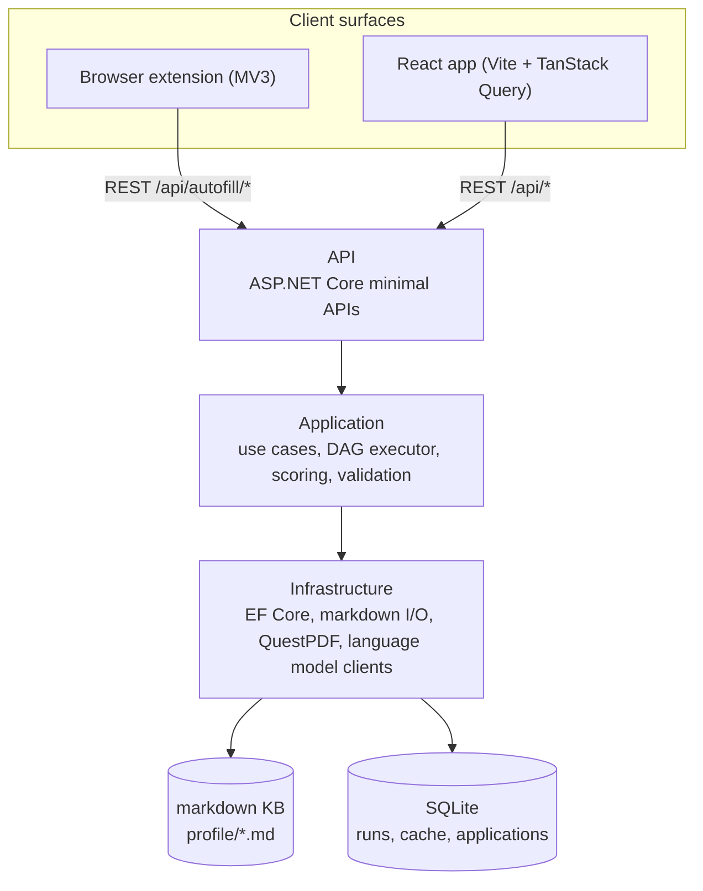
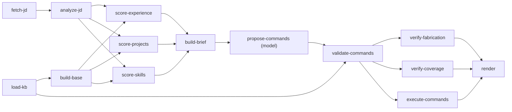

<h1 align="center">ResumeForge</h1>

<p align="center">
  Turn a job posting into a tailored resume without paying a language model to write
  or format one.
</p>

<p align="center">
  <a href="https://github.com/Vick1213/resumeforge/actions/workflows/ci.yml"></a>
  
  <a href="LICENSE"></a>
</p>

---

Job hunting means retailoring the same resume against dozens of postings. Doing that by
hand is slow and repetitive; doing it by asking a language model to rewrite the whole
document every time is slow in a different way — expensive, non-deterministic, and prone
to quietly inventing a metric you never claimed. ResumeForge keeps a markdown knowledge
base of everything you've done, scores it deterministically against a job description,
and asks the model to make a small number of *decisions* — what to include, what order
to put it in, which pre-written phrasing to use — rather than to *write prose*. A
tailoring run's entire model output is typically under 600 tokens.

## Why it's built this way

The expensive part of "AI-tailor my resume" was never the reasoning. It's the token
cost of restating the same resume, in full, on every single request — most of it
unchanged, all of it billed anyway.

**The naive approach:** feed the model your full resume and the job posting, ask it to
rewrite the resume. For an 18-bullet resume across three roles and two projects (roughly
850 tokens of prose), that's ~1,800 input tokens (resume + JD + instructions) and
~900 output tokens — because even bullets the model doesn't change have to be restated
to produce a complete, valid resume back. Run that across 25 applications in a job
search and you've spent something like 45,000 input tokens and 22,000 output tokens
telling yourself the same 18 bullets back, in slightly reworded form, 25 times. Output
tokens are also the expensive half of that split on most providers, and this approach
spends almost all of them on text that already existed.

**ResumeForge's approach:** deterministic C# does BM25 relevance scoring, skill-overlap
matching, and recency weighting over your knowledge base first, producing a *pre-scored
candidate set* — bullet IDs and requirement matches, no full prose. Only then does the
model see anything, and what it sees is a compact brief (requirement text + truncated
candidate snippets, ~500-700 tokens) and what it returns is a command list:

```json
[
  { "op": "exclude", "targets": ["exp:cascade-analytics", "prj:tinyorm"] },
  { "op": "order", "parent": "exp:nimbus-systems", "order": ["exp:nimbus-systems#0", "exp:nimbus-systems#2"] },
  { "op": "selectVariant", "target": "exp:nimbus-systems#0", "variantIndex": 0 },
  { "op": "emphasizeSkills", "skills": ["go", "csharp", "kafka"] }
]
```

That command list is capped at roughly 600 output tokens by construction — at most 6
`rewrite` commands (300 characters each), everything else is IDs, indices, and short
enums referencing content instead of restating it. And crucially, that cost **doesn't
scale with resume length.** A 40-bullet resume and an 18-bullet resume both cost the
model the same ~600 tokens to tailor, because the command list is bounded by the number
of decisions the model makes, not by how much resume exists to repeat back. Deterministic
C# — not the model — does the parsing, scoring, validation, mutation, and rendering; the
model spends its entire budget on judgment calls, and only one node in the whole
pipeline (`propose-commands`) touches it at all.

The system also runs with **no API key**: a deterministic `HeuristicLanguageModel`
produces valid commands by ranking rules alone (include top-scored entries, pick the
best-matching variant, order by relevance, no rewrites), so the whole pipeline — and
this README's examples — work end to end on a fresh clone with nothing configured.

## Architecture



Dependencies point inward — `Api` depends on `Application`, `Application` declares ports
that `Infrastructure` implements, `Infrastructure` is the only layer that knows EF Core
or Markdig exist. Full write-up: [`docs/architecture.md`](docs/architecture.md).

The tailoring pipeline is a DAG, not a straight line — independent stages run
concurrently and a failed branch doesn't kill the run:



`score-experience`, `score-projects`, and `score-skills` run concurrently; so do the two
verifier nodes. `propose-commands` is the only node that spends generation tokens. Full
write-up, including why "runs after" and "consumes" aren't the same thing:
[`docs/graph-engine.md`](docs/graph-engine.md).

## Quick start

Prerequisites: **.NET 10 SDK**, **Node 20+**.

```bash
# Backend — http://localhost:5217, applies EF Core migrations automatically in Development
dotnet restore
dotnet run --project backend/src/ResumeForge.Api

# Frontend — http://localhost:5173, proxies /api to the backend above
cd frontend
npm install
npm run dev

# Extension
cd extension
npm install
npm run build
# then load the build output as an unpacked extension via chrome://extensions
```

No API key needed — without `ANTHROPIC_API_KEY` set, the backend registers
`HeuristicLanguageModel` and the pipeline runs fully offline against the sample
knowledge base in `profile/`. Point your browser at `http://localhost:5173`, or the
API's Scalar docs at `http://localhost:5217/docs`.

## Repo layout

```
.
├── backend/
│   ├── src/
│   │   ├── ResumeForge.Domain/          # records, EntityId, the resume model — no dependencies
│   │   ├── ResumeForge.Application/     # use cases, ports, the graph engine, tailoring commands
│   │   ├── ResumeForge.Infrastructure/  # EF Core, markdown I/O, PDF rendering, model clients
│   │   └── ResumeForge.Api/             # ASP.NET Core minimal APIs, composition root
│   └── tests/                           # xUnit v3 + Shouldly + NSubstitute, one project per layer
├── frontend/                            # React 19 + TypeScript dashboard, KB editor, tailoring UI
├── extension/                           # MV3 browser extension — the autofill cascade
├── profile/                             # sample markdown knowledge base — replace with your own
│   ├── basics.md
│   ├── experience/
│   ├── projects/
│   ├── education/
│   └── certifications/
├── docs/
│   ├── CONTRACTS.md                     # shared type contracts — frozen, authoritative
│   ├── architecture.md
│   ├── graph-engine.md
│   ├── tailoring-commands.md
│   ├── knowledge-base.md
│   └── extension.md
├── Directory.Build.props                # net10.0, Nullable, TreatWarningsAsErrors
├── Directory.Packages.props             # central package version management
└── ResumeForge.slnx
```

## Tech stack

| Layer | Stack |
| --- | --- |
| Language / runtime | C# 13, .NET 10 |
| API | ASP.NET Core minimal APIs, OpenAPI + Scalar (`/docs`) |
| Persistence | EF Core 10, SQLite |
| Rendering / parsing | QuestPDF, Markdig, YamlDotNet |
| Backend tests | xUnit v3, Shouldly, NSubstitute |
| Frontend | React 19, TypeScript (strict), Vite, TanStack Query, Tailwind CSS v4, Radix primitives |
| Frontend tests | Vitest, Testing Library |
| Extension | Manifest V3, TypeScript |

## Design decisions worth reading

- [`docs/architecture.md`](docs/architecture.md) — the layering rule, and why markdown
  files rather than the database are the source of truth for knowledge items.
- [`docs/graph-engine.md`](docs/graph-engine.md) — the DAG executor: concurrency,
  failure isolation, cycle detection, and why an edge means "consumes," not "after."
- [`docs/tailoring-commands.md`](docs/tailoring-commands.md) — the full command
  protocol, the anti-fabrication guard, and a worked JD → commands → diff example.
- [`docs/knowledge-base.md`](docs/knowledge-base.md) — the markdown format, the
  bullet/variant convention, how GitHub import avoids clobbering hand edits, and why
  skills are derived from `tech:` tags rather than a hand-maintained list.
- [`docs/extension.md`](docs/extension.md) — the three-tier autofill cascade and how to
  write a new board adapter.

## Roadmap

- DOCX export (`POST /api/render` currently returns `501` for `docx`; PDF/HTML/Markdown
  are implemented)
- Board adapters beyond the initial five (Greenhouse, Lever, Ashby, Workday,
  SmartRecruiters)
- A second `ILanguageModel` implementation alongside Anthropic's
- Resume version diffing in the application tracker

## License

MIT — see [LICENSE](LICENSE).
