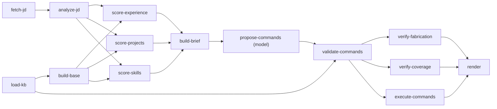

# The graph engine

`ResumeForge.Application.Graph` is a small, dependency-free DAG executor. The tailoring
pipeline — and only the tailoring pipeline needs this; JD analysis and scoring are
called as plain methods within a node — is *declared* as a graph of nodes and edges, not
written as a sequence of `await` calls, so that independent work actually runs
concurrently and one dead branch doesn't take down the whole run.

## Node and edge model

```csharp
public interface IGraphNode
{
    string Name { get; }
    IReadOnlyList<string> DependsOn { get; }
    Task<object?> ExecuteAsync(GraphContext context, CancellationToken ct);
}
```

A node names the nodes it depends on by string. There's no separate edge type — the
edges of the graph are exactly the union of every node's `DependsOn`. `GraphBuilder`
assembles the node set, resolves `DependsOn` into a dependency graph, and
`GraphBuilder.Build()` topologically sorts it (or throws `GraphCycleException` naming
the cycle, at build time — never at runtime).

A node reads its dependencies' output through `GraphContext.Get<T>(nodeName)` (or
`TryGet` for a conditional dependency that might have been skipped) and writes its own
result by returning it from `ExecuteAsync`; the executor stores it under the node's
name for downstream nodes to read.

## "Runs after" is not the same as "consumes"

It's tempting to add an edge any time one thing should happen before another. Don't.
An edge means **B reads A's output through `GraphContext`.** If B merely needs to run
at some point after A for reasons that don't involve A's return value, that's not a
dependency — it's either an artificial constraint you should remove, or evidence B
actually depends on something more specific than "after A".

The tailoring graph is the worked example. `score-experience`, `score-projects`, and
`score-skills` all read from `analyze-jd` (the parsed requirements) and `build-base`
(the canonical document to score bullets from) — genuine data dependencies, so they're
real edges. But nothing about scoring experience requires scoring projects to have
finished first; they don't read each other's output. So there is **no edge between
them**, and the executor runs all three the moment `analyze-jd` and `build-base` are
both done. A straight-line pipeline that ran them one after another wouldn't be wrong,
just slower for no reason — three independent BM25 passes serialized behind each other
instead of overlapped.

The same logic applies to `verify-fabrication` and `verify-coverage`: both consume
`validate-commands`' output, neither consumes the other's, so both run concurrently
after validation and before `render`.

## The tailoring graph

Declared in `TailoringGraphFactory`, per `docs/CONTRACTS.md` §7:



`fetch-jd` and `load-kb` have no dependencies and start together. `propose-commands` is
the only node in the whole graph that spends generation tokens — everything upstream
(analysis, scoring, brief assembly) and everything downstream (`validate-commands`,
both `verify-*` nodes, `execute-commands`, `render`) is deterministic C#.

## Maximum-concurrency scheduling

The executor doesn't run in explicit "waves" or "levels." At any point in time, every
node whose `DependsOn` are all `Succeeded` (or `Skipped` — see conditional edges below)
is eligible and starts immediately, up to `GraphOptions.MaxConcurrency` (default
`Environment.ProcessorCount - 1`, floor `1`). A node never waits on a sibling branch it
doesn't depend on. In the tailoring graph this means, for example, that if `fetch-jd`
happens to be slow (a real HTTP fetch of a job posting) while `load-kb` is fast (reading
local files), `build-base` can be well underway before `analyze-jd` even starts — there
is no artificial barrier forcing the executor to wait for both roots before making
progress on either branch.

## Failure isolation and `Critical`

A node that throws is recorded `Failed` with its `Error` in the trace. Its **transitive
dependents** are marked `Skipped`, not run, and not treated as errors themselves —
they simply never had their inputs available. Branches that don't depend on the failed
node, directly or transitively, run to completion normally. The run as a whole returns
a **partial** `TailoringResult` plus the full trace, rather than throwing — a graph run
degrades, it doesn't abort, by default.

The exception is a node declared `Critical = true`. If a critical node fails, the whole
run fails and the exception propagates instead of producing a partial result. Nothing
in the tailoring graph as declared needs this — a JD that fails to fetch legitimately
should surface as "nothing downstream could run," reflected honestly by cascading
`Skipped` statuses in the trace, not as a 500. `Critical` exists for graphs (or future
nodes) where a partial result would be actively misleading rather than merely
incomplete.

## Conditional edges

`builder.AddNode(...).When(ctx => predicate)` attaches a predicate to a node. If the
predicate evaluates false when the node becomes eligible, the node is marked `Skipped`
without running, and — same as a failed-but-non-critical node — its dependents still
run, receiving `default` from `TryGet` where they'd otherwise have read its result. This
is how a node can be conditionally excluded from a run (for example, a future
`fetch-jd` variant that's skipped entirely when the request already carries `rawText`
and there's nothing to fetch) without forking the graph definition itself.

## Cycle detection

`GraphBuilder.Build()` walks the dependency graph and throws `GraphCycleException`
naming the cycle the moment one is found — before any node has run. A graph is either
valid at build time or it never executes; there's no way to discover a cycle mid-run.

## Tracing

Every node, whatever its outcome, produces one `GraphNodeTrace`:

```csharp
public sealed record GraphNodeTrace
{
    public required string Node { get; init; }
    public required GraphNodeStatus Status { get; init; }   // Succeeded | Failed | Skipped | Cancelled
    public required TimeSpan Duration { get; init; }
    public string? Error { get; init; }
    public int InputTokens { get; init; }
    public int OutputTokens { get; init; }
}
```

The full `IReadOnlyList<GraphNodeTrace>` is part of `TailoringResult` and is also
fetchable on its own via `GET /api/tailor/{runId}/trace`. The React app's `/tailor` route
renders it as a live pipeline view: one row or box per node, colored by status, so a
rejected command or a fabrication-guard failure is visible as "verify-fabrication ran
and flagged something" rather than an opaque final diff. Because `InputTokens` and
`OutputTokens` are recorded per node rather than per run, the UI can show that
`propose-commands` is the only line item with a nonzero cost — the rest of the pipeline
is free.
